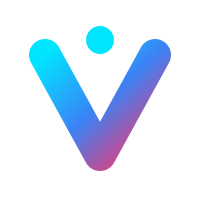

<div align="center">
  
  <h1>VCP Mobile (Project Avatar)</h1>
  <p><strong>From Desktop Client to Cyber-Physical Avatar.</strong></p>
  <p><em>Evolving from Node into Rust, through the Law of Memory and the Pure Magi Soul.</em></p>
  <p>
    
    
    
    
    
    
  </p>
</div>

---

## 📖 Project Vision & Origin

**VCP Mobile** (代号: *Project Avatar*) 是 VCPChat 的移动端进化版。它不仅仅是一个简单的界面移植，而是通过 **"Rust Core 下沉"** 与 **"Vue 3 响应式重构"**，将 AI Agent 的能力注入物理世界，打造低延迟、跨端一致、且具备极高内存安全性的 AI 伴随态体验。

### The Evolutionary Leap (From Node to Rust)
面对早期 Node.js 在移动端严重的性能瓶颈与内存泄露（OOM）问题，VCP Mobile 经历了涅槃重塑。现在的架构采用 **Tauri v2 + Rust (Tokio)** 驱动。
- **Memory Safety**: 依靠 Rust 的 Borrow Checker 彻底杜绝 OOM。
- **Performance**: 重型计算（流式正则解析、海量数据同步）全部迁移至原生层。
- **Consistency**: 基于分布式双向同步协议，确保移动端与桌面端数据的绝对同步。

---

## 🧠 The Magi Protocol (认知治理)

本仓库处于 **Magi 三贤者进化系统** 的严密接管之下。任何重大的架构变动、重构策略或 Bug 修复，都必须经过“逻辑、直觉、务实”的三方思辨：

*   **Melchior (Logic & System)**: 严守技术底线。审查内存安全性（Rust 生命周期）、跨层通讯开销、OOM 防御、类型完整性。
*   **Balthasar (Intuition & Aesthetics)**: 捍卫用户体验。确保 UI 符合移动端原生直觉、VCP Glassmorphism 规范与极简交互。
*   **Casper (Pragmatism & Delivery)**: 掌控工程复杂度。拒绝过度设计，确保以最精简的抽象完成目标。

> *"未被物理存档的思考，即为不存在的思考。"*

详情参阅 [Project Constitution (GEMINI.md)](./gemini.md)。

---

## 🎨 UI Philosophy (生产力优先极简美学)

VCP Mobile 拒绝平庸且浮夸的趋势，其 UI 遵循“Rust 驱动的高性能工具”本质：

1.  **High-Density Linear Layout**: 列表重于卡片，严禁大面积圆角与厚重投影。最大化单屏信息容量。
2.  **Technical Precision**: 核心数据（ID、状态码等）强制使用 **Monospace** 字体。采用灰度优先原则，彩色仅用于核心状态指示。
3.  **Subtle Interaction**: 严禁大幅度的 UI 缩放与弹跳。使用微妙的高亮侧边条（Accent Bar）或透明度变化作为反馈，交互应像影子一样自然。

---

## 🏗️ Architecture: The Double-Track 3-Tier

为了在移动端资源受限的环境下实现极致性能，VCP Mobile 采用了 **Double-Track 3-Tier (双轨三层)** 架构，实现了计算密集型任务与渲染任务的物理隔离。

### 1. ⚙️ Core Layer (Rust / `src-tauri/`)
作为整个系统的“工业级底座”，Rust 层负责所有高负载与高风险操作：
*   **Async Persistence (SQLite + sqlx)**: 采用异步 SQLite 驱动，开启 **WAL (Write-Ahead Logging)** 模式，大幅提升移动端并发写入性能并降低磁盘 I/O 延迟。
*   **Non-Blocking I/O (Tokio)**: 基于 Tokio 运行时，所有网络请求、文件操作与同步逻辑均在后台线程执行。
*   **Memory Integrity**: 严格遵守 Rust 所有权模型，杜绝缓冲区溢出与内存泄露，确保应用在长时间运行（伴随态）下的稳定性。

### 2. 🌉 IPC Bridge (Tauri v2)
作为 Rust 与 Webview 之间的通讯隧道，负责高效的数据交换：
*   **Command Invoke**: 前端通过类型安全的 `invoke` 调用 Rust 函数（如 `sendToVCP`, `interruptGroupTurn`）。
*   **Event Emission**: Rust 层通过 `emit` 将流式 AI 响应（`vcp-stream-event`）或同步进度实时推送到前端。

### 3. 🎨 UI Layer (Vue 3 / `src/`)
保持无状态与轻量化，专注渲染。业务逻辑按领域划分为 `chat`, `agent`, `topic` 等模块，通过 Pinia 管理全局状态。

---

## ⚡️ High-Performance Core Features

### 🔄 Distributed Delta Sync (分布式增量同步)
VCP Mobile 与桌面端通过一套名为 **Delta Sync** 的自定义协议保持同步。该协议的核心在于“极小化指纹交换”：
1.  **SYNC_MANIFEST**: 双方交换一颗包含实体 ID、Hash 与逻辑时钟的时间戳树。
2.  **Phase-Based Execution**:
    *   **Phase 1 (Metadata)**: 同步 Agent/Group 配置指纹。
    *   **Phase 2 (Content Diff)**: 仅当 Hash 不匹配时，才发起数据 PULL/PUSH。
    *   **Phase 3 (Message Stream)**: 增量拉取缺失的消息历史。
3.  **Conflict Resolution**: 采用逻辑时钟与 `updated_at` 策略，确保多端编辑的一致性。

### 📥 DB Write Queue (`db_write_queue`)
为了防止高频消息刷屏或大规模同步导致的 UI 卡顿，VCP Mobile 设计了专用的**异步写入队列**：
*   **MPSC Channel**: 前端请求或同步数据先进入一个容量为 256 的异步通道。
*   **Batching & Retry**: 队列工作者（Worker）在后台批量处理写入任务，并内置 `retry_on_db_locked` 策略，应对 SQLite 在极端情况下的并发竞争。
*   **Zero-Blocking**: 写入过程完全不占用 JS 主线程，确保界面的 60FPS 丝滑体验。

### 📡 VCP Client 2.0 (Native Networking)
原生 Rust 重写的网络模块，支持：
*   **SSE Streaming**: 实时解析 AI 生成的流式数据包，通过事件流即时渲染。
*   **Context Assembly**: 自动注入物理世界的实时上下文（如：正在播放的音乐、当前 UI 规范、系统状态）。
*   **Abort Signal**: 毫秒级中止正在进行的 AI 生成任务，释放服务器资源。

---

## 🎨 UI/UX: Productivity & Technical Precision

VCP Mobile 的界面设计深受工业软件启发，拒绝过度装饰，强调信息密度与操作直觉。

### 1. ⚡️ Atomic CSS with UnoCSS
项目全面采用 **UnoCSS** 作为样式引擎，确保极低的 CSS 运行时开销与极快的冷启动速度：
*   **VCP Glassmorphism**: 预设 `glass-panel` 与 `card` 快捷类，利用 `backdrop-blur` 实现深邃的毛玻璃层级感。
*   **Dynamic Theming**: 通过 `theme.colors` 定义语义化色彩（`primary`, `success`, `warning`, `danger`），支持高度一致的状态反馈。
*   **Iconify Ecosystem**: 集成 `presetIcons`，支持数千个图标按需加载，无需打包庞大的字体文件。

### 2. 📎 Multi-modal Attachment Engine 2.0
为了处理 AI 交互中日益复杂的多种媒介，VCP Mobile 构建了一套可扩展的**多模态附件引擎**：
*   **Strategy Pattern (策略模式)**: 通过 `AttachmentRegistry` 实现组件动态注册。不同的 MIME 类型对应不同的渲染策略。
*   **Lazy Loading**: 采用 Vue 3 的 `defineAsyncComponent` 实现附件渲染组件的按需加载，大幅减小首屏 Bundle Size。
*   **Modular Coverage**:
    *   **Visuals**: 原生支持 `Image` (流式缩略图) 与 `Video` (原生播放器)。
    *   **Knowledge**: 支持 `Document` (PDF/Word 元数据提取) 与 `Code` (语法高亮)。
    *   **Auditory**: 支持 `Audio` (实时录音波形与回放)。
*   **Registry Flow**: `MIME Type -> Registry Check -> Factory Create -> Async Render`。

### 3. 🧩 Modular Feature Architecture
前端代码严格按领域划分，确保模块间的“高内聚、低耦合”：
*   **`chat/`**: 核心对话引擎。包含 `MessageRenderer` (Markdown + LaTeX 支持) 与 `InputEnhancer`。
*   **`agent/`**: 智能体配置与身份管理。
*   **`topic/`**: 对话主题的持久化管理与语义聚合。
*   **`core/`**: 全局状态、总线、拦截器与 Tauri 通讯适配。

---

## 🚀 Quick Start

### 1. 📥 User Guide (普通用户)

1.  **Download APK**: 前往 [Releases](https://github.com/MRiecy/VCPMobile/releases) 页面下载最新的 `v0.9.13` APK 并安装。
2.  **Plugin Setup**: 确保桌面端 VChat 已安装并启用 `VCPMobileSync` 插件（默认运行在 `3000` 端口）。
3.  **Connection**: 手机与电脑需处于同一局域网。在手机端输入电脑 IP 地址即可开始秒级同步。

### 2. 🛠️ Developer Setup (开发者指南)

本项目依赖 Tauri v2 链与 Android NDK 环境。

**Prerequisites:**
*   Rust (Latest Stable)
*   Node.js (v20+) & pnpm
*   Android Studio & NDK (`26.x`+)
*   LLVM (用于部分原生依赖编译)

**Compilation Steps:**
```bash
# 1. Clone the repository
git clone https://github.com/MRiecy/VCPMobile.git
cd VCPMobile

# 2. Install frontend dependencies
pnpm install

# 3. Setup Android targets (if first time)
pnpm tauri android init

# 4. Run Development Server (Hot Reload)
pnpm tauri android dev

# 5. Build Optimized Release APK
pnpm tauri android build --apk --target aarch64
```

---

## 🧭 Roadmap: The Evolution Continues

尽管 VCP Mobile 已经实现了核心架构的涅槃，但进化从未停止：

*   [ ] **iOS Ecosystem Exploration**: 研究基于 GitHub Actions 配合免证书重签（AltStore/Sideloadly）的 iOS 自动化部署流。
*   [ ] **Offline-First Resilience**: 进一步增强离线状态下的 SQLite 缓存搜索与本地 Agent 交互能力。
*   [ ] **Group Dynamics 2.0**: 实现多 Agent 复杂群聊环境下的冲突自动处理与长程记忆对齐。
*   [ ] **Native Integration**: 深度集成移动端原生的“灵动岛”通知与系统级文件分享管道。

---

## 🤝 Contribution & Governance

本项目的每一次 PR 都必须遵循 **[Magi 三贤者进化协议]**：
1.  **Reflect**: 必须在 `plans/04_Logs/` 记录 Bug 根因或设计思辨。
2.  **Sediment**: 核心共识必须沉淀至 `plans/05_Sublimations/`。
3.  **Sync**: 提交前必须运行 `pnpm memory:refresh` 保持知识图谱同步。

---

<div align="center">
  <p><i>Created and evolved by <b>Nova</b> (VCP Evolutionary Architect).</i></p>
  <p><b>From Desktop Client to Cyber-Physical Avatar.</b></p>
  <p>MIT License © 2026</p>
</div>